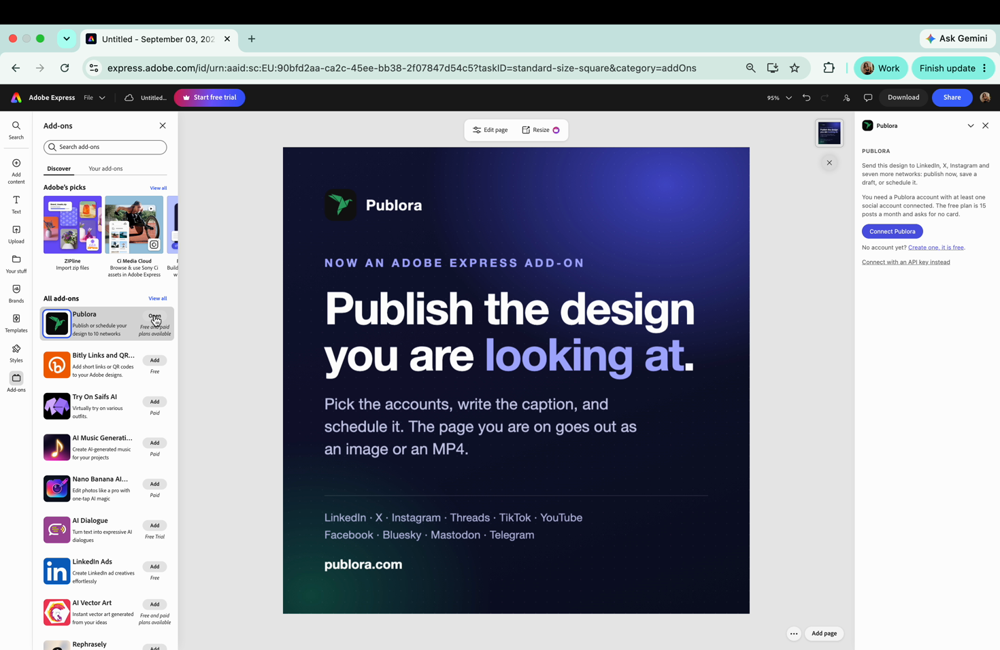
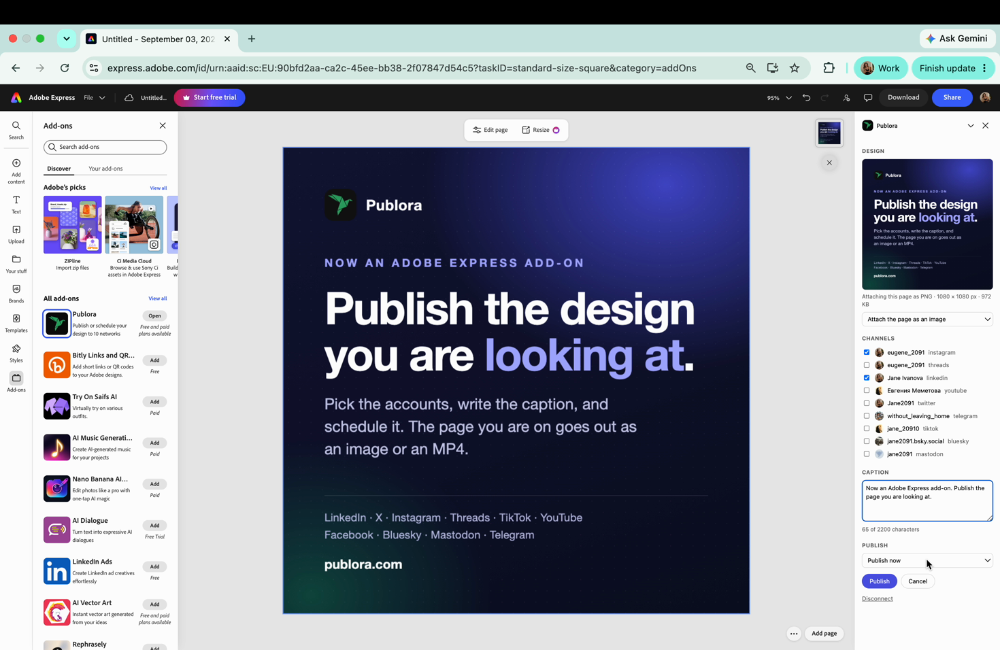
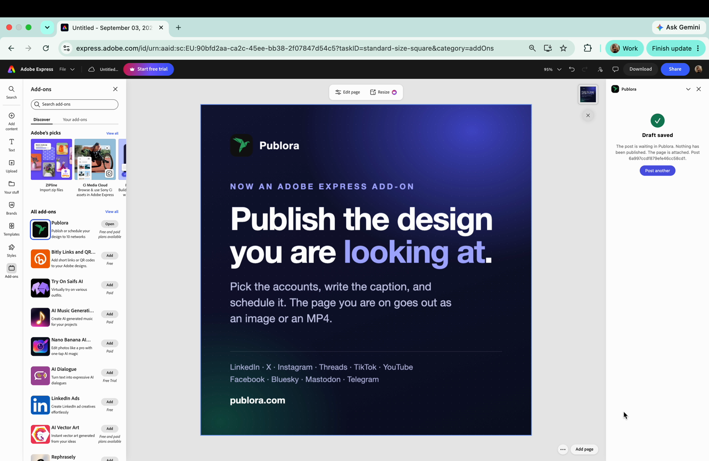

# How to publish to social media from Adobe Express

Install the Publora add-on, sign in once, and send the design you are looking at to LinkedIn, Instagram, TikTok and seven more networks. The add-on renders the current page for you, as an image or as an MP4.

I spent most of August getting this add-on through Adobe's review. Five submissions, four rejections, and the last one was my own fault: I read the summary in their rejection email instead of their guide, fixed the one thing it mentioned, and got turned down again. So I know this panel better than I wanted to. Here is how it works.

### Before you start

You need an Adobe Express account, a Publora account, and at least one social account connected inside Publora. The add-on publishes through connections you already made, it does not create them. The Publora free plan covers 15 posts a month and three accounts and does not ask for a card.

### Install the add-on

1. Open any project in Adobe Express.
2. Click **Add-ons** in the left rail.
3. Search for `Publora` and open the listing.
4. Click **Add**. The panel opens on the right.

### Connect Publora

Press **Connect Publora**. A Publora window opens, shows which account you are authorising, and closes itself once you approve. There is no API key to copy and nothing to paste.

If you would rather not sign in through a window, **Connect with an API key instead** takes a key from `publora.com → Settings → API keys`. The key stays on this machine.

Two browsers need a nudge. Safari blocks the sign-in window until you allow pop-ups for `new.express.adobe.com`. If the window opens but never reports back, use the API key.

### Send a design

**Design.** The add-on renders the page you are on and shows it with its format, size and weight, like `PNG · 1080 × 1080 px · 972 KB`. Three choices: **Attach the page as an image**, **Attach the page as a video**, or **No attachment** for a text-only post. Video works when the page has motion: an animation, a video layer, an animated element. On a static page the panel says so instead of failing quietly.

**Channels.** Your connected accounts with their avatars. If the list is empty, **Connect a social account** opens Publora and **Check again** re-reads the list without reopening the add-on.

**Caption.** One text box and a live count that reads `120 of 280 characters`. The limit shown is the strictest one among the networks you ticked, so X pulls it down to 280 as soon as you tick it.

**Publish.** **Publish now**, **Save as draft**, or **Pick a date and time…** for a scheduled post.

### What the panel checks before it sends anything

Networks reject posts for reasons they explain badly, usually as `Validation failed` after you already pressed the button. That message cost me a full review round, so the panel now checks the rules first and says which one you hit:

- **Instagram** takes pages between 4:5 and 1.91:1, up to 8 MB, and always needs an image or a video.
- **YouTube** takes video only.
- **TikTok** takes videos between 3 seconds and 10 minutes.

If you change the design after the panel rendered it, the panel notices and offers to render the page again, so an outdated picture does not go out with the post. That one was not a reviewer's request. I found it myself while fixing something else, and it was the worse bug of the two.

### When something does not work

**The add-on cannot render the page.** If the page uses premium Adobe Express content and your Express plan is free, the export is blocked on Adobe's side. Replace those assets, or upgrade Express.

**"This page has no motion."** You picked video on a static page. Switch to image.

**Cancel.** Pressing **Cancel** while a post is being created stops the request and deletes the post that was already created. Nothing reaches a social network.

**Nothing published but the post exists.** That is what a draft is. Open the Publora dashboard and publish it there, or schedule it.

### Questions people ask

**Which networks does it cover?** Ten: LinkedIn, X, Instagram, Threads, TikTok, YouTube, Facebook, Bluesky, Mastodon and Telegram. Pinterest can be connected to Publora but cannot be published to from anywhere.

**Does it publish the whole document or one page?** The current page, as one image or one MP4.

**Does it cost anything?** The add-on is free. Publora's free plan covers 15 posts a month and three connected accounts; paid plans start at $2.99 a month per account.

**Where does my design go?** Only the rendered page and the caption reach Publora. The document stays in Express.

**Does it need Adobe Express Premium?** No, unless the page itself uses premium assets. Adobe blocks exporting those on a free Express plan.

---

**Links.** Publora: `publora.com` · Add-on: `express.adobe.com/add-ons?addOnId=w5m31i4jk` · Docs: `docs.publora.com` · The same thing for [Obsidian](/blog/publora-obsidian), [VS Code](/blog/publora-vscode) and [Cursor](/blog/publora-cursor)

If you try it and something behaves differently than described here, write to `support@publora.com`. I read those, and the last three fixes in this panel came from exactly that kind of message.
